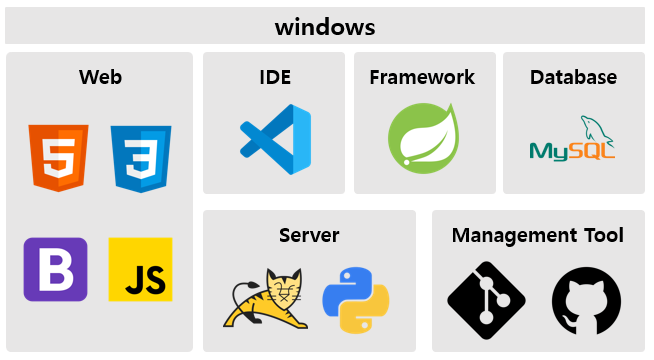
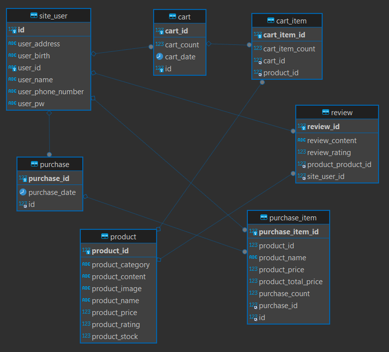
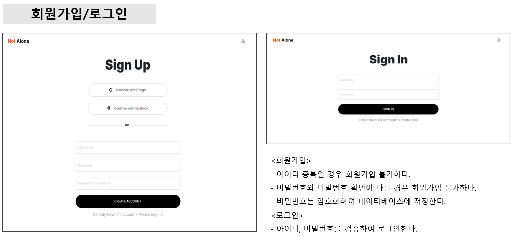
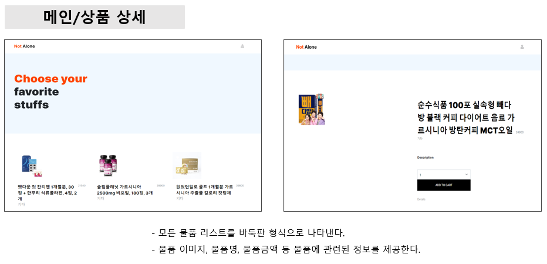
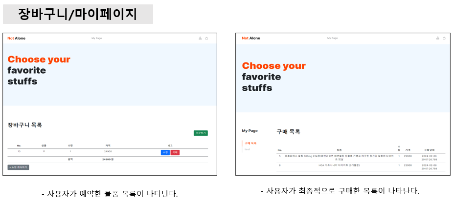
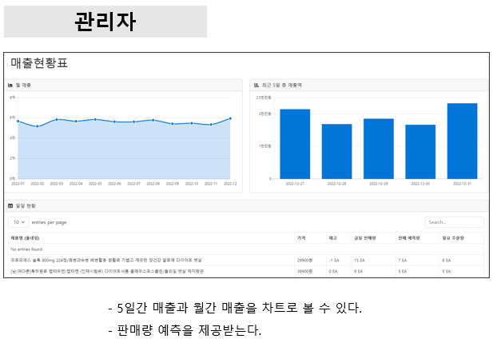
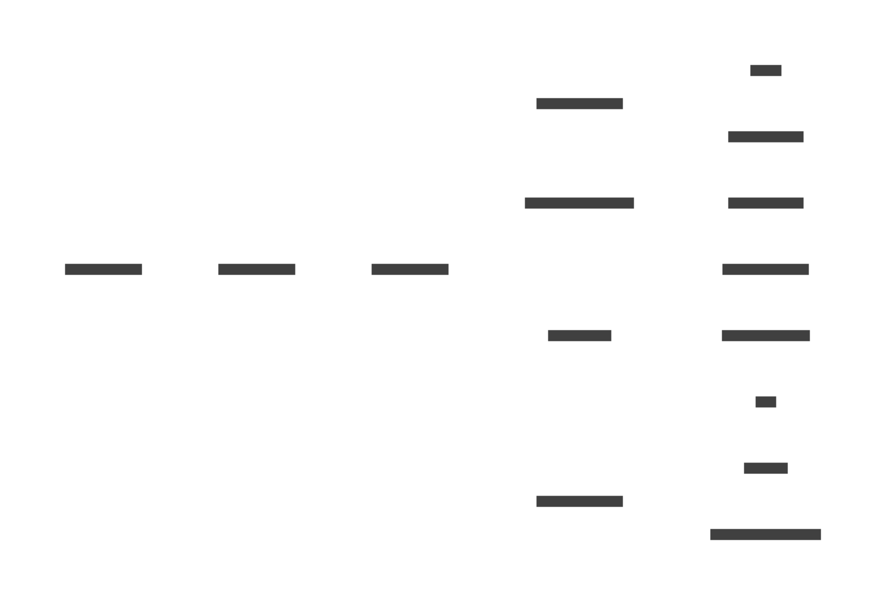

# 머신러닝을 활용한 쇼핑몰 사이트 'NotAlone'

### 🍀 Member

<table>
  <tbody>
    <tr>
      <td align="center"><a href="https://github.com/hyul77"> <b>이준혁</b></a> </td>
      <td align="center"><a href="https://github.com/bbundnam"> <b>정세홍</b></a> </td>
      <td align="center"><a href="https://github.com/soljeong"> <b>정솔</b></a> </td>
      <td align="center"><a href="https://github.com/DaSeul-Seo"> <b>서다슬</b></a> </td>
    </tr>
  </tbody>
</table>

### ✍️ 개발 목적 및 목표
- 본 프로젝트는 Admin 페이지에서 과거의 판매 실적을 활용해 다음날 각 물품의 판매량을 예측하고 재고를 효율적으로 관리할 수 있는 홈쇼핑 웹 서비스 개발을 목표로 한다.
- 홈쇼핑 웹 서비스를 제공한다는 기존 서비스와의 공통점과 Admin 페이지에서 물품들을 더욱 편리하게 관리할 수 있다는 차별점을 둔다.
- 유통기한이 있는 물품 같이 재고 관리를 중요시하는 것들을 머신 러닝을 통해 기존의 판매량을 바탕으로 미래의 판매량을 예측해 재고를 효율적으로 관리하고자 한다.
- 본 프로젝트를 통해 물품 Data만 바꿔 다른 업종으로 적용할 수 있고 다른 기능들도 편하게 추가할 수 있는 프레임을 제작해 추후 다른 모델에 적용하고자 한다. 
- 시작날짜 : 2023년 12월 14일
- V0 완료날짜 : 2023년 12월 20일

### 🛠 개발환경 및 아키텍쳐

### 🌐 ERD
  

### 📒 주요기능

<!-- 1. 로그인
    - 아이디, 비밀번호를 검증하여 로그인한다.
2. 회원가입
    - 아이디 중복일 경우 회원가입 불가하다.
    - 비밀번호와 비밀번호 확인이 다를 경우 회원가입 불가하다.
    - 비밀번호는 암호화하여 데이터베이스에 저장한다.
3. 메인
    - 모든 물품 리스트를 바둑판 형식으로 나타낸다.
4. 물품상세
    - 물품 이미지, 물품명, 물품금액 등 물품에 관련된 정보를 제공한다.
5. 장바구니
    - 사용자가 예약한 물품 목록이 나타난다.
6. 마이페이지
    - 사용자가 최종적으로 구매한 목록이 나타난다.
7. 관리자
    - 5일간 매출과 월간 매출을 차트로 볼 수 있다.
    - 판매량 예측을 제공받는다. -->

### 🌟 활용방안 및 기대효과
1. 통합 홈쇼핑 웹 서비스를 제공한다.
2. 머신러닝 기반의 판매량 예측 기능을 통해 재고량을 효율적으로 관리할 수 있다.
4. 물품 재고를 효율적으로 관리할 수 있다.
5. 본 프로젝트를 통해 물품 Data만 바꿔 다른 업종으로 적용할 수 있다.
6. 다른 기능들도 편하게 추가할 수 있는 프레임 형태로 제작되어 있다.

### 📽️ 시연영상

https://github.com/DaSeul-Seo/NotAlone/assets/67898022/bfa48646-0945-4a50-ae5f-e7a21820e88b

